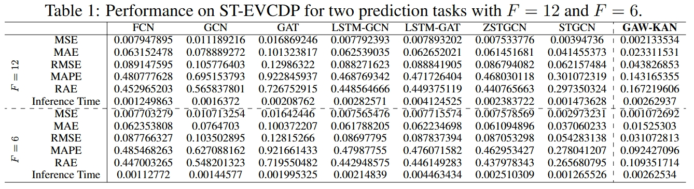
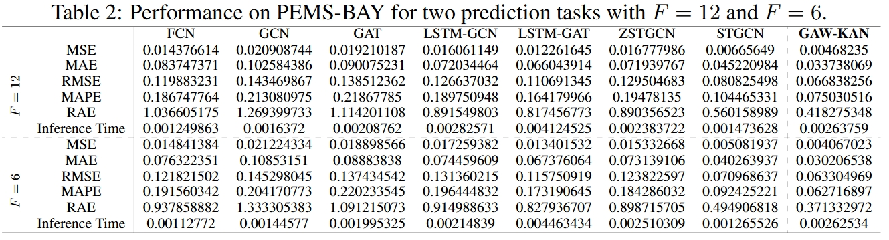

# GAW-KAN

This repository is the official implementation of *GAW-KAN: A Novel Kolmogorov-Arnold Network with Graph Attention and Wavelet Transform-based Layers for Spatial and Temporal Prediction*. 


## Requirements

To install requirements (python==3.9):

```setup
pip install -r requirements.txt
```

## Dataset Preparaton

GAW-KAN model was trained on [ST-EVCDP](https://github.com/IntelligentSystemsLab/ST-EVCDP/tree/main/datasets) dataset or [PEMS-BAY](https://drive.google.com/drive/folders/10FOTa6HXPqX8Pf5WRoRwcFnW9BrNZEIX) dataset. Please download required datasets and put the corresponding file using the following form:

```dataset
[data]------- 
  |--[PEMS-BAY] 
    |-- [graph_sensor_locations_bay.csv]
    |-- [adj_mx_bay.pkl]
    |-- [pems-bay.h5]
  |-- [ST-EVCDP]       
```

Please note that ./data/PEMS-BAY/adj_mx_bay.pkl is downloaded from [adj_mx_bay.pkl](https://github.com/liyaguang/DCRNN/blob/master/data/sensor_graph/adj_mx_bay.pkl).

## Training and Evaluation

To train and Evaluation the model(s) in the paper, run this command:

```train
bash run.sh model_name=GawKAN dataset=PEMS-BAY seq_len=12 pre_len=12 is_pre_train=true use_bspline=true
```

## Pre-trained Models

You can download pretrained models here:

- [GAW-KAN model](https://drive.google.com/file/d/1U48MCGs5PjEL6Sxs7sAXnhFBb9m3daVw/view?usp=sharing) trained on PEMS-BAY using $H=12$ and $F=12$.

## Results

Our model achieves the following performance on ST-EVCDP and PEMS-BAY using $H=12$ and $F=12$:




