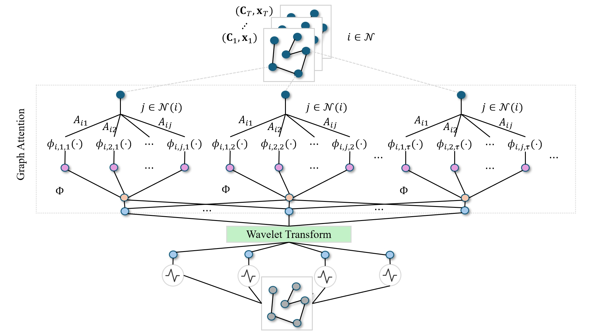

# GAW-KAN

This repository is the official implementation of *GAW-KAN: A Novel Kolmogorov-Arnold Network with Graph Attention and Wavelet Transform-based Layers for Spatial and Temporal Prediction*. 



## Requirements

To install requirements (python==3.9):

```setup
pip install -r requirements.txt
```

## Dataset Preparaton

GAW-KAN model was trained on [ST-EVCDP](https://github.com/IntelligentSystemsLab/ST-EVCDP/tree/main/datasets) dataset or [PEMS-BAY](https://drive.google.com/drive/folders/10FOTa6HXPqX8Pf5WRoRwcFnW9BrNZEIX) dataset. Please download required datasets and put the corresponding file using the following form:

```dataset
[data]------- 
  |--[PEMS-BAY] 
    |-- [graph_sensor_locations_bay.csv]
    |-- [adj_mx_bay.pkl]
    |-- [pems-bay.h5]
  |-- [ST-EVCDP]       
```

Please note that ./data/PEMS-BAY/adj_mx_bay.pkl is downloaded from [adj_mx_bay.pkl](https://github.com/liyaguang/DCRNN/blob/master/data/sensor_graph/adj_mx_bay.pkl).

## Training and Evaluation

To train and Evaluation the model(s) in the paper, run this command:

```train
bash run.sh model_name=GawKAN dataset=PEMS-BAY seq_len=12 pre_len=12 is_pre_train=true use_bspline=true
```

## Pre-trained Models

You can download pretrained models here:

- [My awesome model](https://drive.google.com/mymodel.pth) trained on ImageNet using parameters x,y,z. 

>📋  Give a link to where/how the pretrained models can be downloaded and how they were trained (if applicable).  Alternatively you can have an additional column in your results table with a link to the models.

## Results

Our model achieves the following performance on :

### [Image Classification on ImageNet](https://paperswithcode.com/sota/image-classification-on-imagenet)

| Model name         | Top 1 Accuracy  | Top 5 Accuracy |
| ------------------ |---------------- | -------------- |
| My awesome model   |     85%         |      95%       |

>📋  Include a table of results from your paper, and link back to the leaderboard for clarity and context. If your main result is a figure, include that figure and link to the command or notebook to reproduce it. 


## Contributing

>📋  Pick a licence and describe how to contribute to your code repository. 
